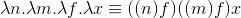
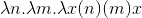
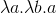
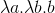
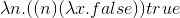
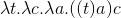

Lamda calculus in Scheme
===========================

This repository contains code to write lambda expressions in the Scheme programming language.

Since Scheme is a Lisp dialect and Lisp is based on lambda calculus, it is veary easy to make write down lambda expressions in Scheme provided with a small level of abstractions.

## Built-in functions 

### Overview

This project mainly contains code for doing some basic math on natural numbers using the *Church numbers*.

It also contains an "if" expression and the boolean values `true` and `false`.

Other programming constructions like "cons", "car","cdr"... can be easily written as lambda expressions, but are not included.

In addition to these a function "to-int" is provided as well in order to easily verify calculations.

Finally all functions that represent lambda expressions don't allow multiple arguments to be passed, currying should be used instead.

### Reference

plus:



times:



true: 



false:



iszero:



if:



## Example

Code:

```
(load "lambda.ss")
(define c2 (c-n 2))
(define c3 (c-n 3))

(display (to-int c3)) (newline)
(display (to-int c2)) (newline)

(display (to-int (times ((plus ((plus c2) c3)) c2) c3))) (newline)
(display (((lif (iszero c2)) #t) #f))
```

Output:

```
3
2 
21 
#f
```

## Contribute

If you found an error in the code or in one of the examples you can open an issue or fork this repository, fix it yourself and send a pull request.

In case you want to add some more programming constructions to the current list, feel free to do so as well. However keep in mind that everything should be kept as simple as possible and that all functions must be able to be rewritten as valid lambda expressions.

## License

MIT
